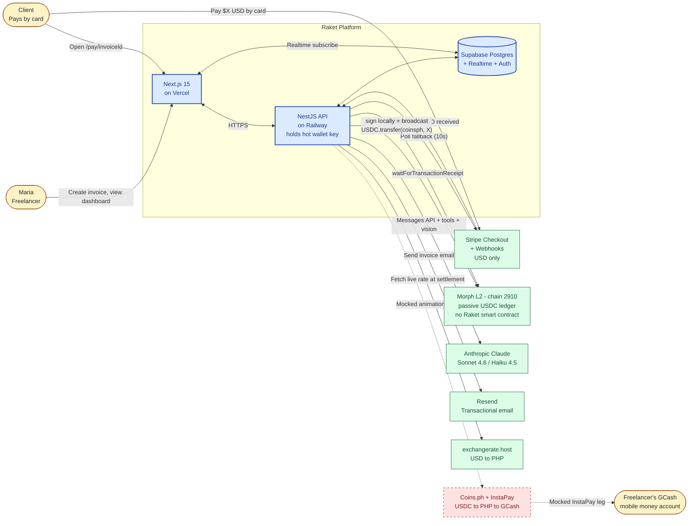
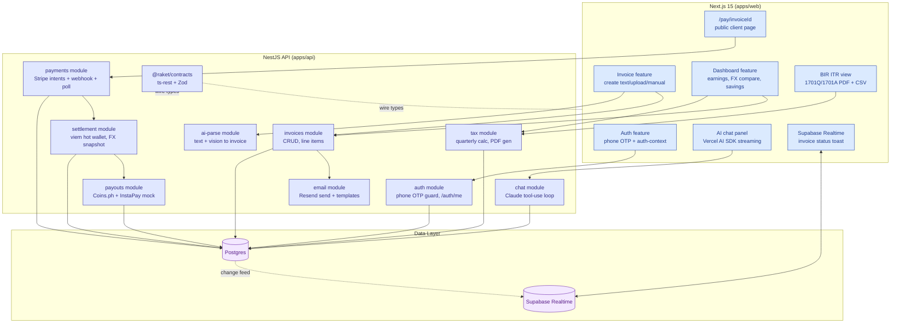
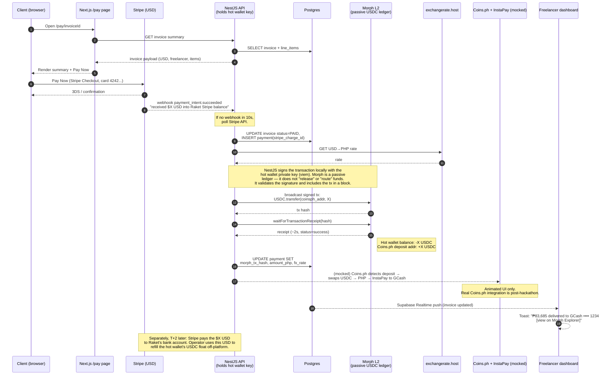
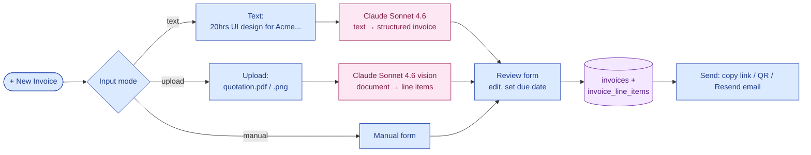
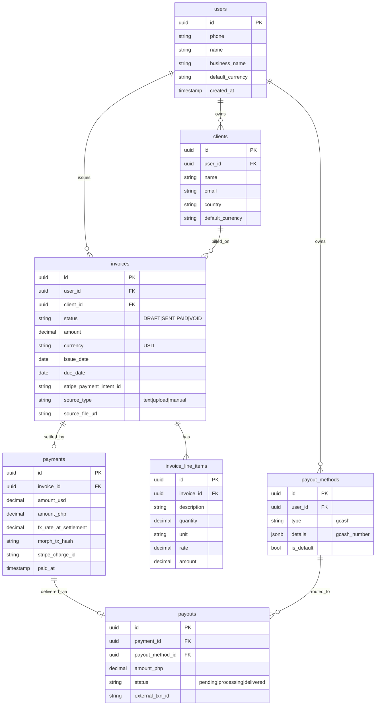
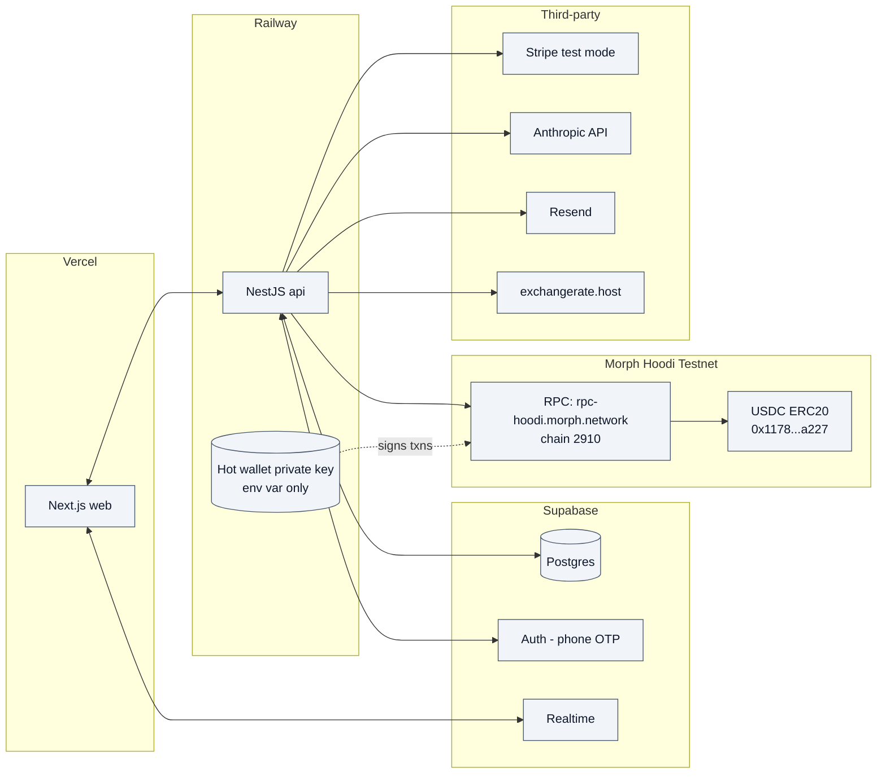

# Raket — Architecture

Companion to [`prd.md`](./prd.md). Source of truth for the system layout: who talks to whom, where state lives, what is real vs mocked for the hackathon demo.

The diagrams below use Mermaid; they render natively on GitHub.

---

## 1. System Context

The outer view: human actors, the Raket platform as one box, and every external service it depends on. Mocked legs are marked.

**Important.** Morph is a passive USDC ledger. It does not route, convert, or hold USD. The NestJS hot wallet **signs** an ERC-20 `transfer` locally with `viem` and **broadcasts** it to Morph; Morph just validates the signature and includes the tx in a block.

**Legend.** Blue = Raket-owned. Green solid = real external integration. Red dashed = mocked for hackathon; real in production.

---

## 2. Mental Model: USD and USDC Are Parallel Pipes

A common misread of the diagram above: _"Stripe sends USD into Morph and the chain converts it to USDC."_ That's wrong, and worth calling out because it shapes how you reason about every other part of the system.

**No currency crosses the Stripe ↔ Morph boundary.** Raket runs two independent settlement pipes. The Stripe webhook is the trigger that ties them together — not a money transfer.

```mermaid
flowchart LR
    classDef usd fill:#dcfce7,stroke:#166534,color:#14532d
    classDef usdc fill:#dbeafe,stroke:#1e40af,color:#1e3a8a
    classDef php fill:#fee2e2,stroke:#991b1b,color:#7f1d1d,stroke-dasharray: 5 5
    classDef glue fill:#fef3c7,stroke:#92400e,color:#1f2937

    subgraph USD["USD pipe — off-chain, Stripe banking rails"]
        direction LR
        ClientCard[Client card<br/>$1,000]:::usd
        StripeBal[Raket's Stripe<br/>USD balance]:::usd
        RaketBank[Raket bank account<br/>USD float]:::usd
    end

    Webhook{{Stripe webhook<br/>NestJS:<br/>'we got paid $X USD'}}:::glue

    subgraph USDC["USDC pipe — on-chain, Morph L2"]
        direction LR
        HotWallet[Raket hot wallet<br/>USDC float<br/>~50,000 USDC pre-funded]:::usdc
        CoinsAddr[Coins.ph deposit<br/>address on Morph]:::usdc
    end

    subgraph PHP["PHP pipe — mocked for hackathon"]
        direction LR
        CoinsPhp[Coins.ph PHP<br/>balance]:::php
        GCashAcct[Freelancer's GCash<br/>mobile money]:::php
    end

    ClientCard -->|"card auth"| StripeBal
    StripeBal -->|"T+2 USD bank payout"| RaketBank
    RaketBank -.->|"operator refills<br/>USDC float off-platform"| HotWallet

    StripeBal -.->|"triggers"| Webhook
    Webhook -.->|"NestJS spends from<br/>USDC float independently"| HotWallet

    HotWallet -->|"viem ERC-20<br/>USDC.transfer"| CoinsAddr
    CoinsAddr -.->|"Coins.ph swaps<br/>USDC → PHP"| CoinsPhp
    CoinsPhp -.->|"InstaPay"| GCashAcct
```

**How to read this.**

- **USD pipe (green):** real, off-chain, slow. Stripe holds the client's USD; bank payouts to Raket land T+2.
- **USDC pipe (blue):** real, on-chain, fast (~2s). The hot wallet starts pre-funded; every paid invoice spends from this float.
- **PHP pipe (red, dashed):** mocked for the hackathon. In production, Coins.ph (BSP-licensed VASP) handles the USDC→PHP swap and InstaPay leg to GCash.
- **The webhook (amber):** the only thing that crosses pipes — as a _signal_, not as money. USD doesn't become USDC; NestJS independently spends USDC because the webhook told it Stripe got paid.

**Why this matters.** Raket is fronting USDC out of its own balance for every paid invoice. Stripe reimburses days later in USD; the operator turns that back into USDC off-platform. §13.13 of `prd.md` calls the hot wallet "scaffolding" for exactly this reason — at any real volume Raket would be the bank.

**Production swap-in.** Stripe Stablecoin Payments collapses both pipes: Stripe converts the client's USD → USDC internally and deposits USDC directly to Raket's settlement wallet on Morph. The hot-wallet refill loop disappears, and Raket no longer floats anything.

---

## 3. Component View

Inside the Raket boxes. Names line up with the modules in `apps/web/src/features/*` and `apps/api/src/modules/*`.

`@raket/contracts` is the wire spec. Both sides break at compile time when a contract changes — by design, per [`docs/api-contract-convention.md`](./api-contract-convention.md).

---

## 4. Payment & Settlement Sequence

The demo path end-to-end. This is the 4-minute on-stage run. Real legs are solid; mocked legs are dashed.

**Why webhook + poll.** Webhooks are the primary signal; the 10s poll is the demo-killer mitigation from §9 of `prd.md` — if Stripe is slow, we still settle.

**Why `waitForTransactionReceipt`.** Morph finality is ~2s; awaiting the receipt synchronously means we only write `morph_tx_hash` to the DB after the chain has confirmed, so the toast we surface to the freelancer is never a lie.

**Why "Morph is passive" matters.** There is no Raket smart contract on Morph (`prd.md` §13.14). The chain is doing exactly one thing: executing an ERC-20 `transfer` whose authorization is the hot wallet's signature. All business logic — _should we send? how much? to whom?_ — lives in NestJS. Morph is the venue, not an actor.

---

## 5. Invoice Creation Flow

Three input modes, one form. Claude does the heavy lifting on the text and upload paths.

---

## 6. Data Model

From §7 of `prd.md`. One user owns clients, invoices, payout methods. Invoices fan out to line items, payments, payouts.

**Source-of-truth notes.**

- `payments.amount_php` is **snapshotted at settlement time** using the FX rate fetched then. AI queries read this stored value; we never re-quote a live rate against historical payments.
- `payments.morph_tx_hash` is only written after `waitForTransactionReceipt` confirms — its presence is the truth that money moved on-chain.
- `payouts.status` advances `pending → processing → delivered`; the last two transitions are mocked for the demo.

---

## 7. What's Real vs Mocked

Pulled from §5 and §13 of `prd.md` — call this out explicitly so reviewers can see the seam between hackathon scaffolding and the production path.

| Capability              | Hackathon                                                                                                                               | Production path                                                                                                                  |
| ----------------------- | --------------------------------------------------------------------------------------------------------------------------------------- | -------------------------------------------------------------------------------------------------------------------------------- |
| Client card payment     | **Real** Stripe test mode                                                                                                               | Stripe live mode                                                                                                                 |
| USD → USDC "conversion" | **Off-platform.** Hot wallet pre-funded with testnet USDC; NestJS spends from float when Stripe webhook fires. USD never touches Morph. | **Stripe Stablecoin Payments** — Stripe converts USD→USDC and deposits USDC directly to Raket's wallet on Morph. No Raket float. |
| Morph settlement        | **Real** — NestJS signs ERC-20 `transfer` with `viem`, broadcasts to Morph Hoodi testnet                                                | Real on Morph mainnet                                                                                                            |
| USDC → PHP off-ramp     | **Mocked** — animated UI sequence only                                                                                                  | Coins.ph API (BSP-licensed VASP)                                                                                                 |
| PHP → GCash delivery    | **Mocked**                                                                                                                              | InstaPay via Coins.ph                                                                                                            |
| Invoice email           | **Real** Resend                                                                                                                         | Real Resend                                                                                                                      |
| AI parsing + chat       | **Real** Claude (Sonnet 4.6 + Haiku 4.5)                                                                                                | Same                                                                                                                             |
| Phone OTP               | **Real** Supabase Auth, **mocked** SMS delivery (code shown on screen)                                                                  | Real SMS via Supabase/Twilio                                                                                                     |
| BIR ITR                 | **Prepared** (PDF + CSV) — freelancer files via eBIRForms                                                                               | Same. Filing stays with freelancer until CAS accreditation.                                                                      |

The hot-wallet float is the single biggest hackathon-only piece. Decision 13 in `prd.md` is the rationale: every paid invoice draws USDC from Raket's balance, Stripe reimburses days later in USD — at any real volume Raket would be the bank. Stripe Stablecoin Payments collapses that bridge into Stripe's existing rails post-hackathon.

---

## 8. Deployment Topology

**Security note (from §13.22).** `MORPH_HOT_WALLET_PRIVATE_KEY` lives in Railway env vars only — never in source, never in `.env.example`. NestJS does a balance check on startup and warns below 500 testnet USDC.

---

## 9. Cross-References

- Product context: [`prd.md`](./prd.md)
- API contracts (the wire): [`api-contract-convention.md`](./api-contract-convention.md)
- API service layout: [`api-convention.md`](./api-convention.md)
- Frontend feature layout: [`web-convention.md`](./web-convention.md)
- Local dev setup: [`ONBOARDING.md`](./ONBOARDING.md)
