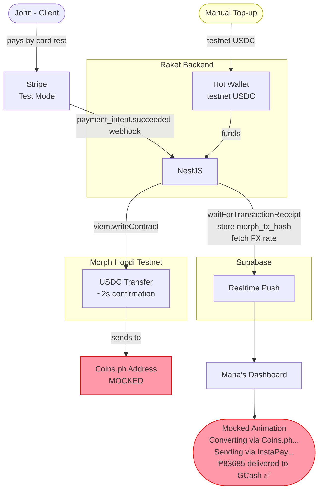
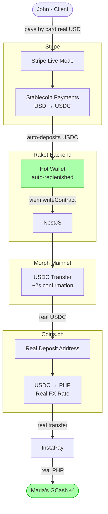
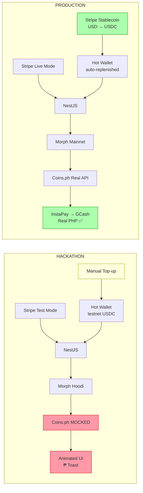

# Payment Flow Diagrams

## Hackathon Flow

```mermaid
flowchart TD
    A([Manual Top-up]) -->|testnet USDC| B

    subgraph Raket Backend
        B[Hot Wallet\ntestnet USDC]
        D[NestJS]
    end

    C([John - Client]) -->|pays by card test| E
    E[Stripe\nTest Mode] -->|payment_intent.succeeded webhook| D
    D -->|viem.writeContract| F
    B -->|funds| D

    subgraph Morph Hoodi Testnet
        F[USDC Transfer\n~2s confirmation]
    end

    F -->|sends to| G[Coins.ph Address\nMOCKED]
    D -->|waitForTransactionReceipt\nstore morph_tx_hash\nfetch FX rate| H

    subgraph Supabase
        H[Realtime Push]
    end

    H --> I[Maria's Dashboard]
    I --> J([Mocked Animation\nConverting via Coins.ph...\nSending via InstaPay...\n₱83685 delivered to GCash ✅])

    style G fill:#f9a,stroke:#f00
    style J fill:#f9a,stroke:#f00
    style A fill:#ffd,stroke:#aa0
```

## Production Flow

```mermaid
flowchart TD
    C([John - Client]) -->|pays by card real USD| E

    subgraph Stripe
        E[Stripe Live Mode]
        ES[Stablecoin Payments\nUSD → USDC]
        E --> ES
    end

    ES -->|auto-deposits USDC| B

    subgraph Raket Backend
        B[Hot Wallet\nauto-replenished]
        D[NestJS]
        B -->|viem.writeContract| D
    end

    D --> F

    subgraph Morph Mainnet
        F[USDC Transfer\n~2s confirmation]
    end

    F -->|real USDC| G

    subgraph Coins.ph
        G[Real Deposit Address]
        GX[USDC → PHP\nReal FX Rate]
        G --> GX
    end

    GX -->|real transfer| I[InstaPay]
    I -->|real PHP| J([Maria's GCash ✅])

    style J fill:#afa,stroke:#0a0
    style B fill:#afa,stroke:#0a0
```

## Side-by-Side Comparison

```mermaid
flowchart LR
    subgraph HACKATHON
        direction TB
        H1[Manual Top-up] --> H2[Hot Wallet\ntestnet USDC]
        H3[Stripe Test Mode] --> H4[NestJS]
        H2 --> H4
        H4 --> H5[Morph Hoodi]
        H5 --> H6[Coins.ph MOCKED]
        H6 --> H7[Animated UI\n₱ Toast]
    end

    subgraph PRODUCTION
        direction TB
        P1[Stripe Stablecoin\nUSD → USDC] --> P2[Hot Wallet\nauto-replenished]
        P3[Stripe Live Mode] --> P4[NestJS]
        P2 --> P4
        P4 --> P5[Morph Mainnet]
        P5 --> P6[Coins.ph Real API]
        P6 --> P7[InstaPay → GCash\nReal PHP ✅]
    end

    style H6 fill:#f9a,stroke:#f00
    style H7 fill:#f9a,stroke:#f00
    style H1 fill:#ffd,stroke:#aa0
    style P7 fill:#afa,stroke:#0a0
    style P1 fill:#afa,stroke:#0a0
```
